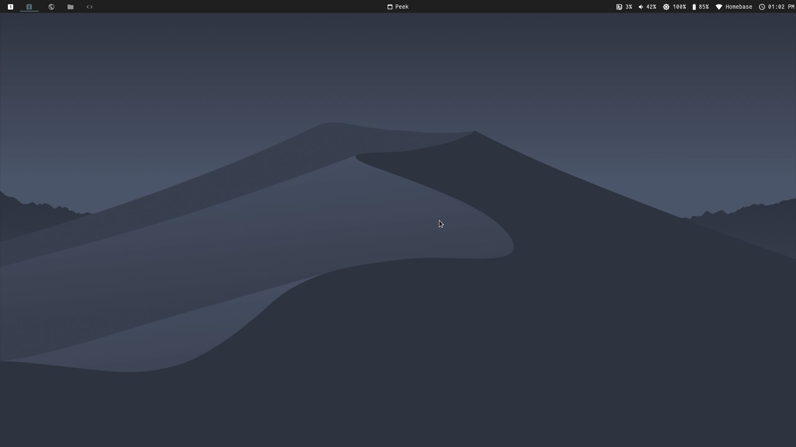

# i3_python_extensions
This script aims to extend the features of the i3wm through the i3ipc python library



## Script Features
- A floating mode that is workspace specific, with an togglable autoresize mode
- A script to toggle the i3bar to manage systray icons
- Togglable Autotiling of windows in a spiral pattern

| Keybinding | Description |
| --- | --- |
| Ctrl+Alt+T | Toggles autotiling |
| Ctrl+Alt+W | Toggles i3bar |
| Ctrl+Alt+F | Toggles floating mode |
| Ctrl+Alt+Shift+F | Toggles floating mode for the next window only |
| Ctrl+Alt+R | Toggles autoresizing of floating windows mode |

## Installation
First install the required python librarys, this will need to be installed with sudo as the script requires sudo to run
```
sudo pip install keyboard i3ipc
```
Then add the following line to your i3 config file
```
exec_always echo "SUDOPASSWORD" | sudo -S python3 /PATH/TO/i3_python_extensions.py
```
